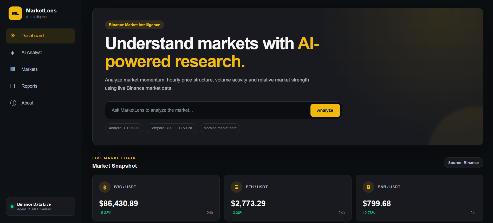
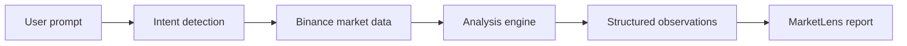
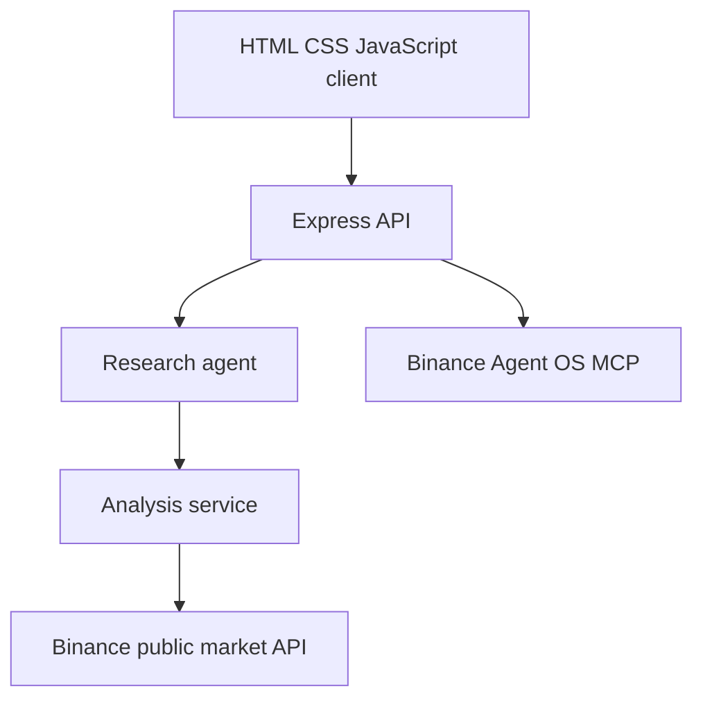

# MarketLens AI

**Explainable crypto market intelligence powered by live Binance data.**

MarketLens AI turns market prices, 24-hour performance, hourly candle structure, and volume activity into structured research reports instead of leaving users to interpret raw numbers alone.

[Open the live demo](https://marketlens-ai-ten.vercel.app) · [View the repository](https://github.com/donatofaith/marketlens-ai)

## Product preview

[](https://marketlens-ai-ten.vercel.app)

*MarketLens combines supported research prompts with live BTC, ETH, and BNB market data in one explainable research workspace.*

> **Ask a market question → collect Binance data → analyze the evidence → receive a readable report**

Built for the **Binance Agent OS Mini Hackathon**.

**Track:** Track A — Build an AI Agent with Agent OS

## The problem

Crypto dashboards provide large amounts of data, but users still have to connect price movement, trading range, volume, and recent candle structure themselves. MarketLens organizes those signals into a repeatable research workflow and explains what the current data shows.

## What MarketLens does

Users can ask:

- `Analyze BTCUSDT`
- `Compare BTC, ETH & BNB`
- `Morning market brief`

MarketLens then:

1. identifies the requested research task;
2. retrieves current Binance market data;
3. evaluates performance, range position, volume, and recent structure;
4. compares supported assets when requested; and
5. returns observations, risks, and limitations in a structured report.

## Core capabilities

### Single-asset analysis

- Current market price
- 24-hour performance
- Position inside the 24-hour range
- Recent completed hourly candle structure
- Recent volume activity
- Explainable observations and limitations

### Multi-asset comparison

- Relative performance across BTC, ETH, and BNB
- Quote-volume comparison
- Recent hourly structure
- Relative strength and weakness

### Morning market brief

- Market breadth
- Broad market condition
- Strongest and weakest supported assets
- Highest-volume asset
- Strongest recent hourly structure

## Judge path

1. Open the [live demo](https://marketlens-ai-ten.vercel.app).
2. Run **Analyze BTCUSDT**.
3. Review the live price, 24-hour range, recent structure, and report explanation.
4. Run **Compare BTC, ETH & BNB**.
5. Run **Morning market brief**.
6. Inspect the API and MCP routes to understand the data and Agent OS integration.

## Research workflow



## Architecture



The market-data and analysis layers are separated. This makes the source data easier to verify and keeps each observation tied to measurable inputs.

## Binance Agent OS and MCP

MarketLens includes a Model Context Protocol client for the Binance Agent OS endpoint:

```text
https://agent.binance.com/mcp/agentic
```

The integration exposes status and tool-discovery routes. During development, the Agent OS MCP connection was also authenticated and verified in Visual Studio Code using live BTCUSDT data.

MarketLens remains useful if the remote MCP service is unavailable because its research reports use Binance's public market-data endpoints directly. The app is read-only and never places trades.

## API routes

| Method | Route | Purpose |
|---|---|---|
| `GET` | `/api/health` | Service health |
| `GET` | `/api/markets` | BTC, ETH, and BNB market snapshot |
| `POST` | `/api/agent/analyze` | Run a supported research request |
| `GET` | `/api/mcp/status` | Check Binance Agent OS MCP connectivity |
| `GET` | `/api/mcp/tools` | Discover available MCP tools |

Example request:

```bash
curl -X POST http://localhost:3000/api/agent/analyze \
  -H "Content-Type: application/json" \
  -d '{"query":"Analyze BTCUSDT"}'
```

## Run locally

```bash
git clone https://github.com/donatofaith/marketlens-ai.git
cd marketlens-ai
npm install
cp .env.example .env
npm run dev
```

Open [http://localhost:3000](http://localhost:3000).

No trading credentials are required. The current build uses public, read-only Binance market endpoints.

## Project structure

```text
marketlens-ai/
├── client/                 # Browser interface
├── server/
│   ├── routes/             # HTTP endpoints
│   ├── services/           # Agent, analysis, Binance, and MCP services
│   └── server.js           # Express application
├── docs/
│   ├── architecture.md
│   └── demo-script.md
├── .env.example
├── vercel.json
└── README.md
```

## Technology

- HTML5
- CSS3
- Vanilla JavaScript
- Node.js
- Express
- Binance public market APIs
- Binance Agent OS
- Model Context Protocol
- Vercel

## Security and data handling

- The app uses read-only public market data.
- No exchange account or trading permission is required.
- MarketLens does not request withdrawal or order-placement access.
- User research prompts are processed for the requested report and are not presented as account data.
- Environment files are ignored by Git and the repository contains placeholders only.
- Errors returned to the main analysis endpoint use a general message instead of internal details.

## Honest limitations

- The supported comparison set is BTC, ETH, and BNB.
- Reports describe current and recent market data; they do not predict future prices.
- The research engine is a transparent intent-and-analysis workflow, not an autonomous trading system.
- Remote Agent OS MCP availability depends on the Binance service and its authentication requirements.
- The app does not place trades, manage funds, or provide personalised financial advice.

## Research, not financial advice

MarketLens is an educational market-research tool. Its reports describe observable market information and should not be treated as financial advice, a price prediction, or a recommendation to trade.

## Creator

Built by **Faith Oluwalana** for the Binance Agent OS Mini Hackathon.

- GitHub: [@donatofaith](https://github.com/donatofaith)
- Live product: [marketlens-ai-ten.vercel.app](https://marketlens-ai-ten.vercel.app)

## License

[MIT](LICENSE)
